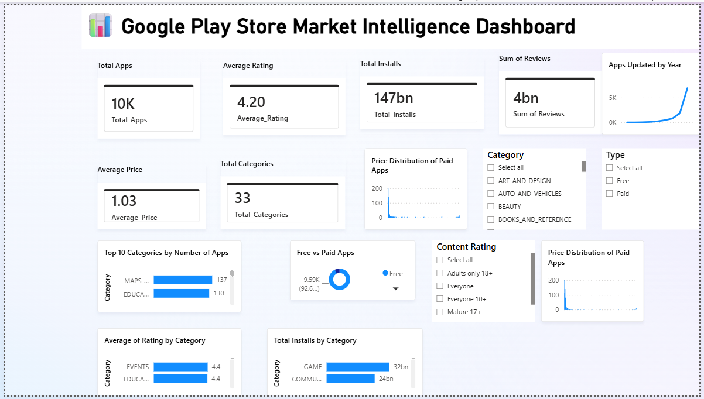
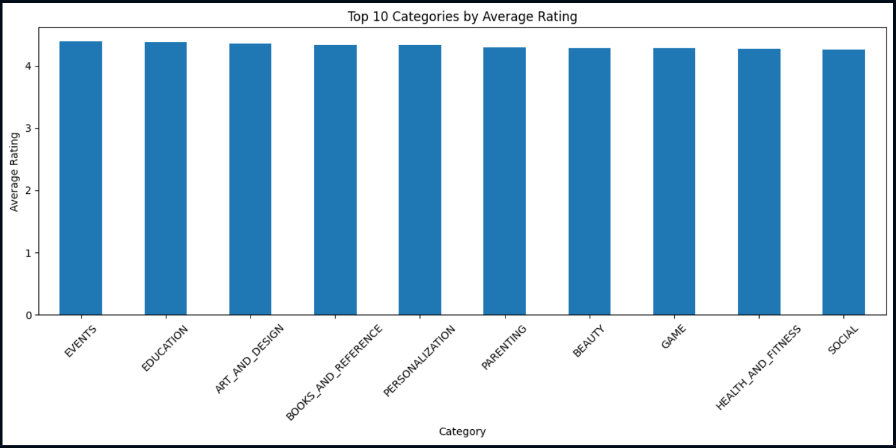
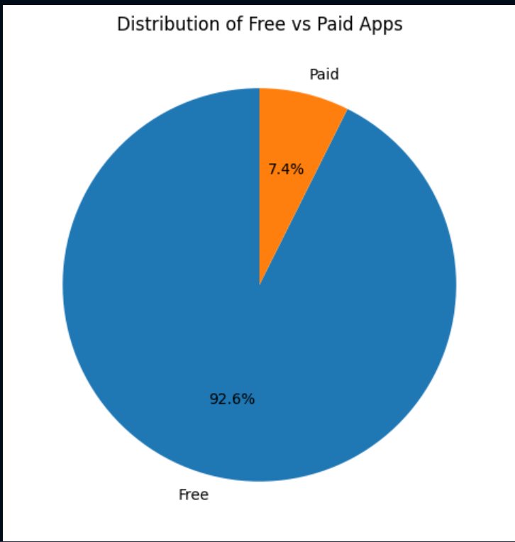
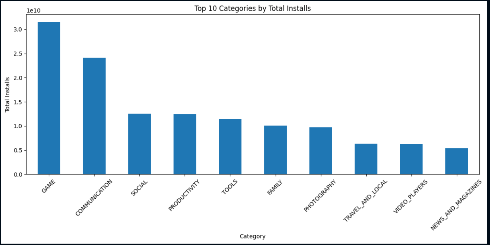
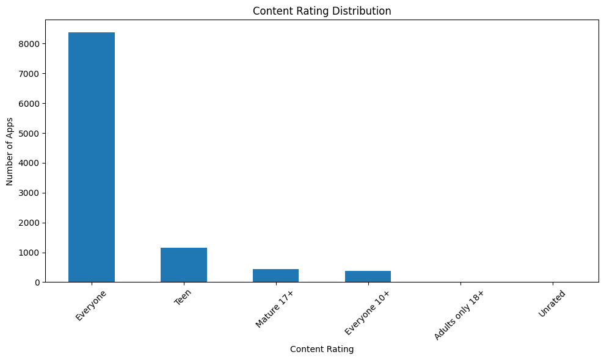
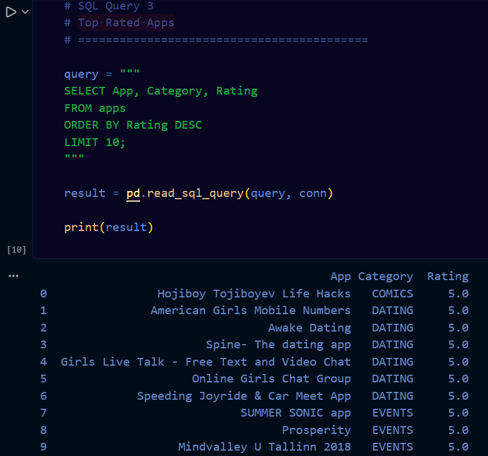
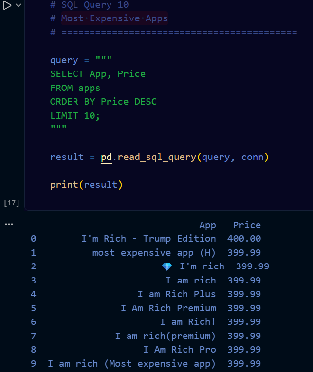
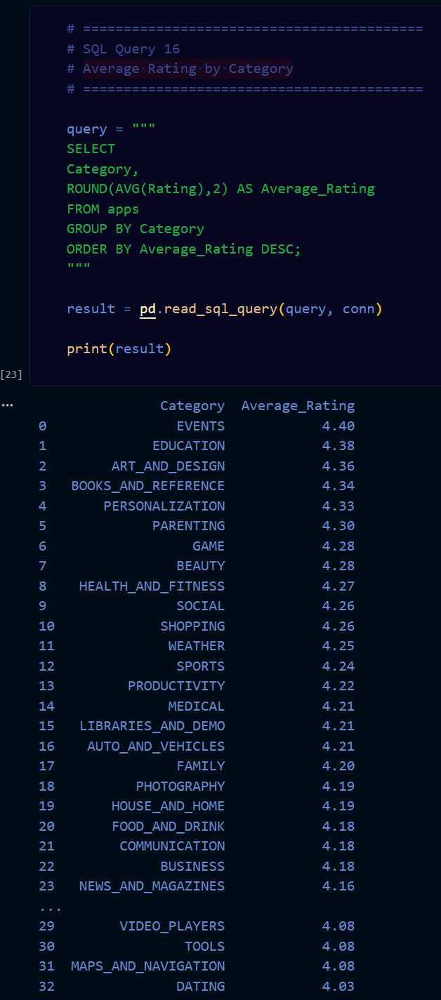
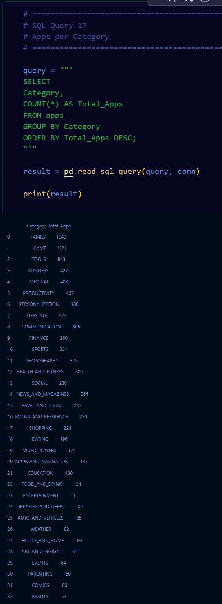
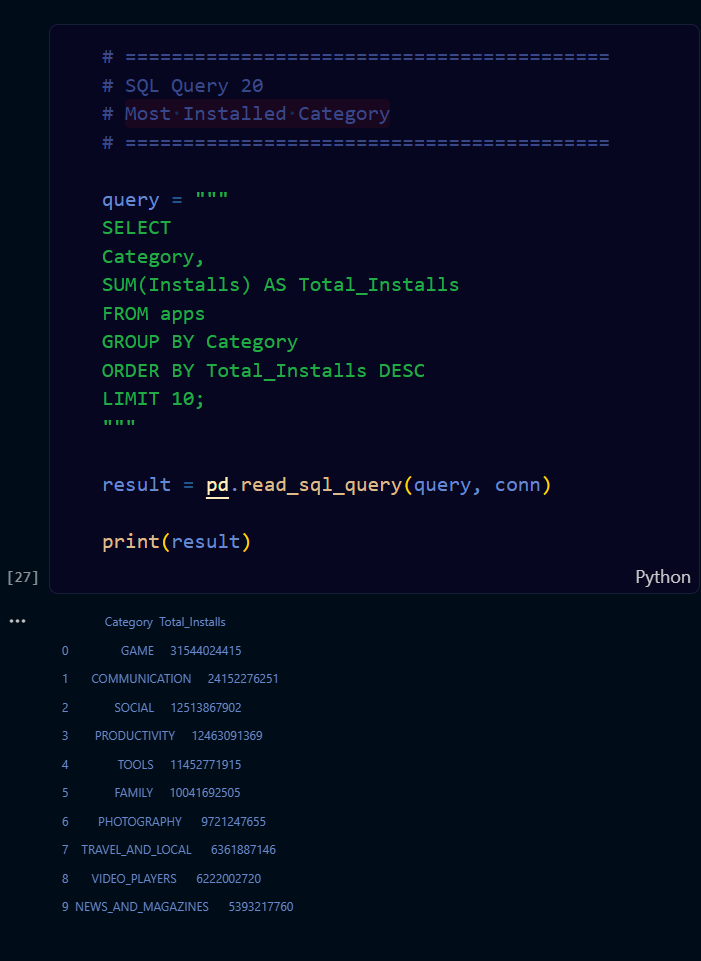

# 📊 Google Play Store Market Intelligence Dashboard

## 📌 Project Overview

This project is an end-to-end **Data Analytics** project that analyzes the Google Play Store dataset to uncover meaningful business insights using **Python, SQL, and Power BI**.

The project demonstrates the complete analytics workflow, including data cleaning, exploratory data analysis (EDA), SQL-based analysis, and an interactive Power BI dashboard.

---

## 🚀 Project Objectives

- Clean and preprocess raw Google Play Store data.
- Analyze app ratings, installs, pricing, and categories.
- Perform SQL queries to answer business questions.
- Build an interactive Power BI dashboard.
- Generate actionable insights from app market trends.

---

## 🛠️ Tech Stack

- Python
- Pandas
- NumPy
- Matplotlib
- Seaborn
- SQL
- Power BI
- Jupyter Notebook

---

## 📂 Project Structure

```text
Google_Play_Store_Market_Intelligence/
│
├── Dataset/
├── Cleaned_Data/
├── Python/
├── SQL/
├── PowerBI/
├── Screenshots/
├── Report/
├── requirements.txt
├── .gitignore
└── README.md
```

---

## 📊 Dashboard Features

- KPI Cards
  - Total Apps
  - Average Rating
  - Total Installs
  - Total Reviews
  - Average Price
  - Total Categories

- Top Categories by Number of Apps
- Free vs Paid Apps
- Average Rating by Category
- Total Installs by Category
- Apps Updated by Year
- Price Distribution of Paid Apps
- Interactive Filters (Category, Type, Content Rating)

---

## 🔍 SQL Analysis

The project includes SQL queries such as:

- Count Records
- Top Rated Apps
- Paid vs Free Apps
- Most Installed Apps
- Average Rating by Category
- Categories with Highest Installs
- Most Expensive Apps
- Highest Rated Category
- Apps Updated in 2018

---

## 📈 Key Insights

- Most apps on the Play Store are free.
- The GAME category has one of the highest install counts.
- FAMILY and TOOLS contain a large number of applications.
- Most paid apps are priced below \$10.
- Average app ratings are above 4.0 across many popular categories.

---

## ▶️ How to Run

1. Clone the repository.

```bash
git clone https://github.com/YOUR_USERNAME/google-play-store-market-intelligence-dashboard.git
```

2. Install the required libraries.

```bash
pip install -r requirements.txt
```

3. Open the Jupyter notebooks.

4. Run the SQL queries.

5. Open the Power BI dashboard (.pbix).

---

## 📷 Project Screenshots

### Power BI Dashboard



### Python Analysis












### SQL Analysis















---

## 👩‍💻 Author

**Supriya Laxmi Bai Banoth**

Aspiring Data Analyst | Python | SQL | Power BI | Data Visualization
